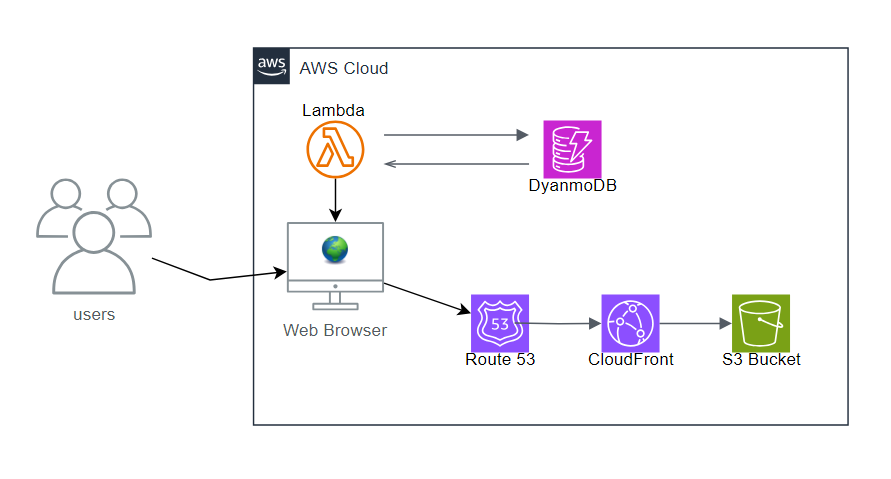

# Serverless Web Application

## Overview

This project demonstrates a serverless web application hosted on AWS. The application uses Amazon S3 and Amazon CloudFront for frontend delivery, Amazon Route 53 for DNS routing, AWS Lambda for backend request processing, and Amazon DynamoDB for NoSQL data storage.

## Architecture

Users access the application through a web browser. Route 53 resolves the domain and routes traffic to CloudFront, which delivers frontend assets stored in an S3 bucket. Backend requests are handled by Lambda functions, and application data is stored in DynamoDB.

## AWS Services Used

- Amazon S3
- Amazon CloudFront
- Amazon Route 53
- AWS Lambda
- Amazon DynamoDB

## Implementation Notes

- Hosted static frontend assets in an S3 bucket.
- Used CloudFront to improve global delivery performance and reduce latency.
- Configured Route 53 for domain name resolution.
- Used Lambda to process application requests without managing servers.
- Used DynamoDB to support create, read, update, and delete operations.

## Security Considerations

- Serverless backend reduces server management overhead.
- DynamoDB provides managed database access without direct server exposure.
- CloudFront can be paired with secure bucket access policies and HTTPS delivery.

## Outcome

The project produced a scalable serverless application architecture and provided practical experience with common AWS services used in modern cloud-native web applications.

