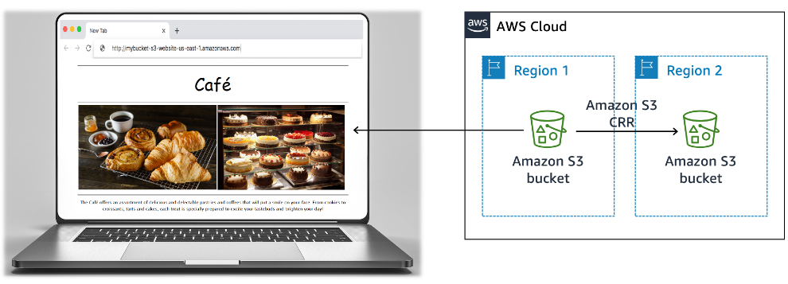

# Static Web Hosting for a Cafe

## Overview

This project documents a static cafe website hosted on Amazon S3. The design focuses on public accessibility, durability, resilience, and cost optimization.

## Architecture

Website content is stored in a public S3 bucket and accessed by users through a browser. Cross-Region Replication copies data from the primary S3 bucket to a secondary bucket in another region for disaster recovery.

## AWS Services Used

- Amazon S3
- S3 Cross-Region Replication
- S3 Versioning
- S3 Lifecycle Policies

## Implementation Notes

- Stored static website files in an S3 bucket.
- Enabled public read access for website availability.
- Used Cross-Region Replication to duplicate content into a second AWS region.
- Enabled versioning to protect against accidental deletion or overwrites.
- Applied lifecycle policies to transition older or less frequently accessed files to lower-cost storage classes.

## Security and Resilience Considerations

- Versioning helps recover from accidental changes.
- Cross-Region Replication improves resilience during regional issues.
- Lifecycle policies help control long-term storage costs.
- Public bucket access should be limited to only the files required for website delivery.

## Outcome

The project created a durable, resilient, and cost-aware static website hosting pattern using Amazon S3.

