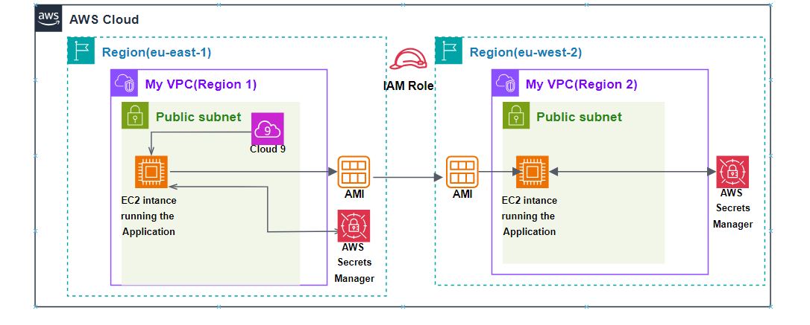

# Dynamic Website for a Cafe

## Overview

This project demonstrates a highly available and secure cafe application deployed on Amazon EC2 across multiple AWS regions. The design uses AMI replication and AWS Secrets Manager to support disaster recovery and secure credential management.

## Architecture

The cafe application runs on an EC2 instance in a public subnet in the primary region. An Amazon Machine Image is created from the application instance and replicated to a secondary region. AWS Secrets Manager is used in both regions to securely manage sensitive credentials.

## AWS Services Used

- Amazon EC2
- Amazon Machine Images
- AWS Identity and Access Management
- AWS Secrets Manager
- Cross-region replication pattern

## Implementation Notes

- Launched the cafe application on EC2 in the primary region.
- Created an AMI from the configured application instance.
- Replicated the AMI to a secondary region to support recovery.
- Used IAM roles to support cross-region replication actions.
- Stored sensitive values such as database passwords and API keys in Secrets Manager.

## Security and Availability Considerations

- Secrets Manager centralizes sensitive credential management.
- AMI replication provides a recovery path if the primary region becomes unavailable.
- IAM roles reduce the need for long-lived credentials.

## Outcome

The project produced a multi-region recovery design for a dynamic web application and strengthened understanding of EC2-based application deployment, AMI replication, IAM, and secure secrets handling.

