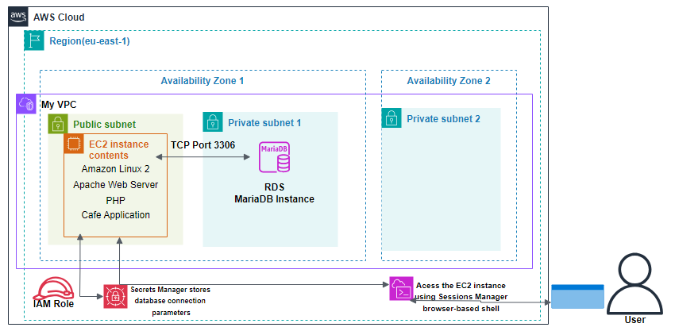

# Migrating a Database to Amazon RDS

## Overview

This project demonstrates migrating a cafe application's database from a MariaDB database running on an EC2 instance to an Amazon RDS MariaDB instance. The architecture places the application in a public subnet and the managed database in a private subnet.

## Architecture

The web application runs on an Amazon Linux 2 EC2 instance with Apache, PHP, and the cafe application. The RDS MariaDB instance runs in a private subnet and accepts database traffic from the application over TCP port 3306. AWS Secrets Manager stores database connection parameters, and AWS Systems Manager Session Manager provides secure browser-based access to the EC2 instance.

## AWS Services Used

- Amazon EC2
- Amazon RDS for MariaDB
- Amazon VPC
- AWS Secrets Manager
- AWS Identity and Access Management
- AWS Systems Manager Session Manager

## Implementation Notes

- Deployed the application server in a public subnet.
- Created the RDS MariaDB instance in a private subnet.
- Allowed application-to-database communication over TCP port 3306.
- Exported existing MariaDB data from the EC2 instance using `mysqldump`.
- Imported the exported data into the RDS database.
- Updated application connection settings to use the RDS endpoint and credentials stored in Secrets Manager.
- Used Session Manager instead of SSH for instance access.

## Security Considerations

- RDS runs in a private subnet, reducing public exposure.
- Session Manager avoids direct SSH access.
- Secrets Manager protects database credentials.
- IAM roles grant required access without embedding credentials in the application.

## Outcome

The project moved database responsibilities from a self-managed EC2 database to managed Amazon RDS, improving scalability, operational control, and security posture.

