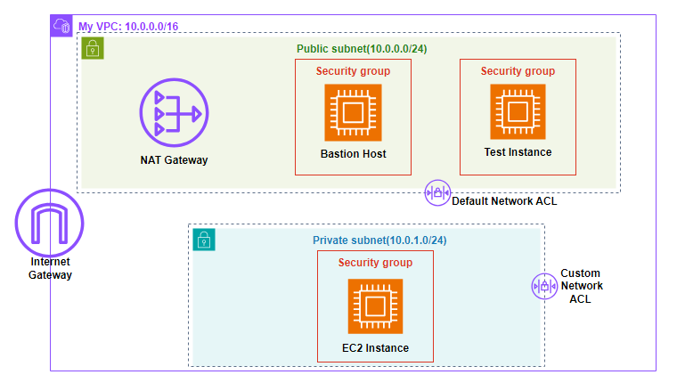

# Creating a VPC Network Environment for a Cafe

## Overview

This project designs a secure VPC environment with public and private subnets. The architecture allows controlled administrative access to private resources while enabling outbound internet connectivity for instances that should not be directly exposed.

## Architecture

The VPC contains a public subnet and a private subnet. The public subnet hosts a bastion host, a test instance, a NAT Gateway, and access to the Internet Gateway. The private subnet hosts an EC2 instance protected from direct internet access. Security groups and Network ACLs control traffic between the subnets and external destinations.

## AWS Services Used

- Amazon VPC
- Public and private subnets
- Amazon EC2
- Bastion host
- NAT Gateway
- Internet Gateway
- Security groups
- Network ACLs

## Implementation Notes

- Created a VPC with CIDR block `10.0.0.0/16`.
- Created a public subnet using `10.0.0.0/24`.
- Created a private subnet using `10.0.1.0/24`.
- Placed the bastion host and test instance in the public subnet.
- Placed the private EC2 instance in the private subnet.
- Used the bastion host as the controlled access point for private resources.
- Routed private outbound traffic through the NAT Gateway and Internet Gateway.
- Applied security groups and Network ACLs to regulate allowed traffic.

## Security Considerations

- Private EC2 instances are not directly reachable from the internet.
- Bastion host centralizes administrative access.
- Network ACLs add subnet-level traffic control.
- Security groups enforce instance-level traffic rules.

## Outcome

The project created a segmented VPC network that balances secure access, outbound connectivity, and controlled exposure of cloud resources.

