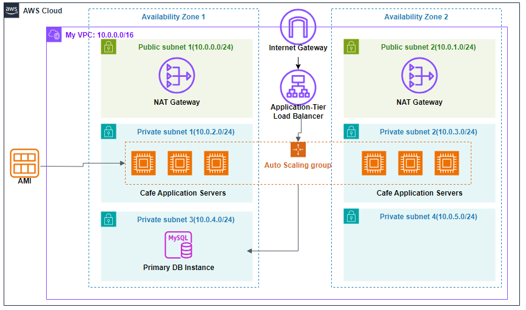

# Creating a Scalable and Highly Available Environment for a Cafe

## Overview

This project designs a scalable and highly available cafe application environment across multiple Availability Zones. It uses public and private subnets, NAT Gateways, an Application Load Balancer, Auto Scaling, and a MySQL database layer.

## Architecture

The VPC spans two Availability Zones. Public subnets provide internet-facing infrastructure and NAT Gateways for outbound access from private resources. Private subnets host cafe application servers managed by an Auto Scaling Group. An Application Load Balancer distributes traffic to the application tier, and a primary MySQL database instance supports application data storage.

## AWS Services Used

- Amazon VPC
- Public and private subnets
- Internet Gateway
- NAT Gateways
- Application Load Balancer
- Auto Scaling Group
- Launch template
- Amazon EC2
- MySQL database instance

## Implementation Notes

- Inspected VPC settings, CIDR blocks, subnets, and route tables.
- Expanded the network across multiple Availability Zones.
- Configured NAT Gateways and Internet Gateway routing.
- Created an Application Load Balancer and target groups.
- Created a launch template defining instance configuration, AMI, instance type, security groups, and user data.
- Created an Auto Scaling Group from the launch template.
- Tested load balancing through the ALB DNS name.
- Tested scaling behavior by generating load and monitoring instance changes.

## Availability and Scalability Considerations

- Multi-AZ placement improves fault tolerance.
- Auto Scaling helps maintain performance as demand changes.
- Load balancing distributes requests across healthy application instances.
- NAT Gateways allow private resources to reach the internet without direct inbound exposure.

## Outcome

The project produced a fault-tolerant and scalable web application environment that demonstrates core AWS patterns for production-ready application hosting.

